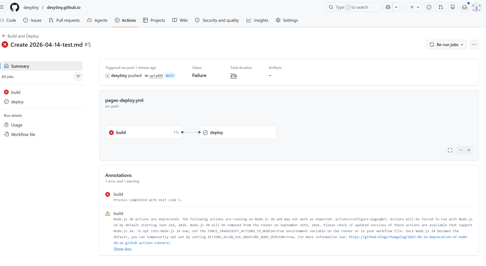
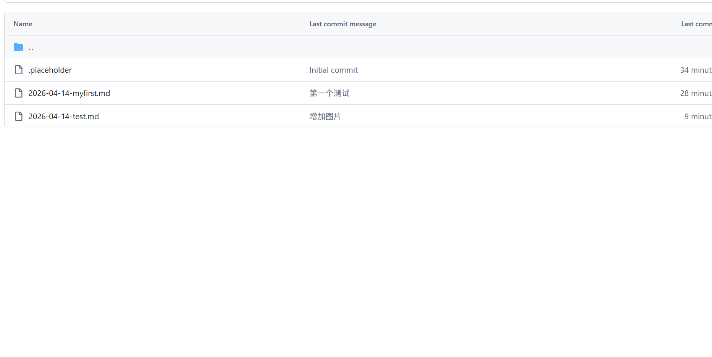

# Java 基础

## Java 基本数据类型
Java 中的基本数据类型分为 4 类 8 种：

### 1. 整数类型
- byte：字节型，占 1 字节
- short：短整型，占 2 字节
- int：整型，占 4 字节（默认）
- long：长整型，占 8 字节

### 2. 浮点类型
- float：单精度，占 4 字节
- double：双精度，占 8 字节（默认）

### 3. 布尔类型
- boolean：true / false

### 4. 字符类型
- char：单个字符，使用单引号

---

## 注意事项
- 整数默认类型：**int**

- 浮点默认类型：**double**

- 定义 long 类型需加后缀：`L` 或 `l`

- 定义 float 类型需加后缀：`F` 或 `f`

  
  
  