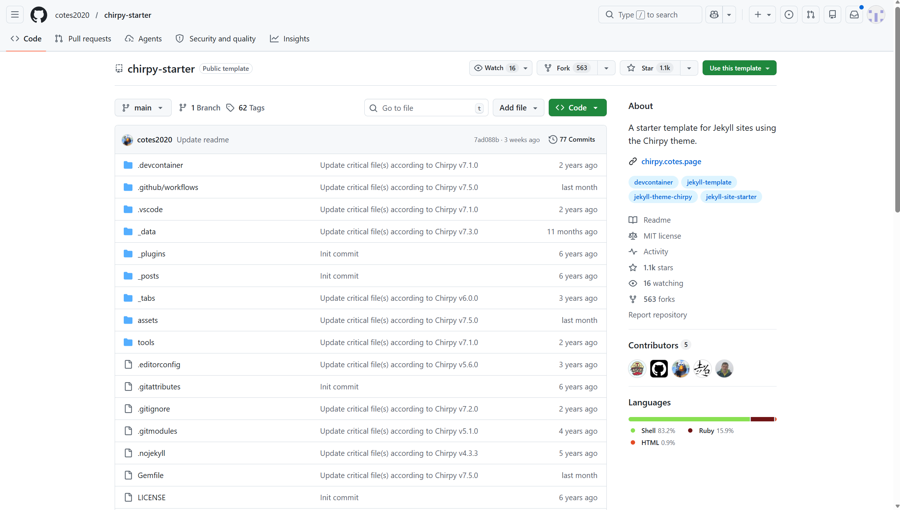
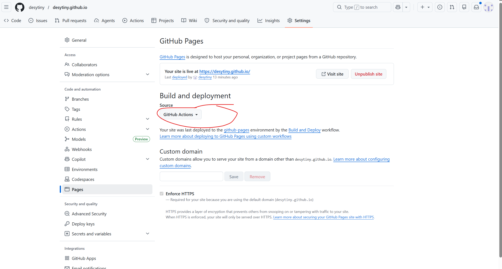
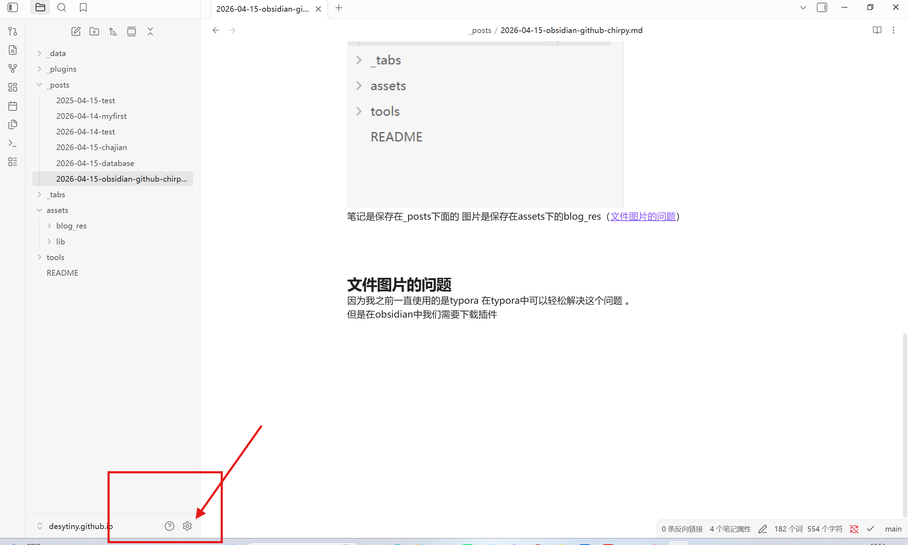
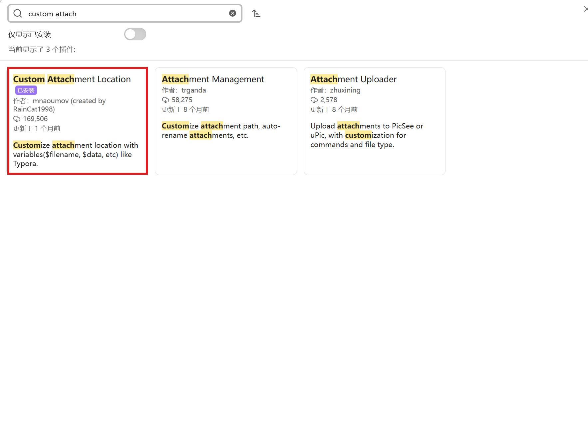
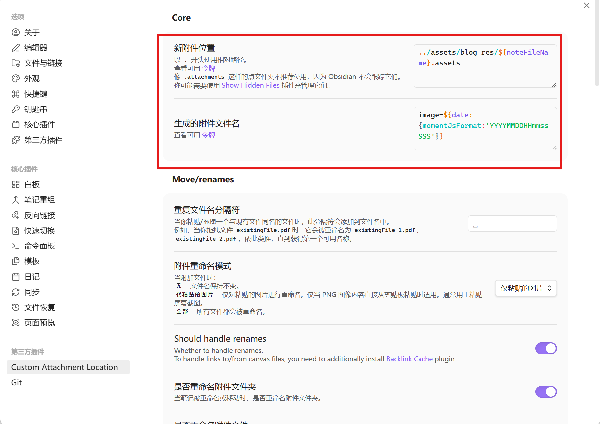

# 一.使用仓库chripy

在GitHub上面搜索(https://github.com/cotes2020/chirpy-starter) 

出现该页面点击右上方的use this template
创建新的仓库：名字是你的github名字.github.io
创建成功后clone到本地文件夹中 如果觉得麻烦可以下载GitHub desktop 可以帮助我们使用git命令

笔记是保存在_posts下面的 图片是保存在assets下的blog_res（[文件图片的问题](2026-04-15-obsidian-github-GitHub.md#文件图片的问题)）
我们在刚使用的chripy中选择设置（setting）选择pages

source中选择GitHub actions等待一分钟就可以进入个人页面了

# git自动上传
下载插件git之后就可以自动上传了

# 文件图片的问题
因为我之前一直使用的是typora 在typora中可以轻松解决这个问题 。
但是在obsidian中我们需要下载插件

点击搜索

下载成功后在设置成这样

然后打开
内部链接设置成相对路径 不使用wiki 这样基本上就没有什么大问题了