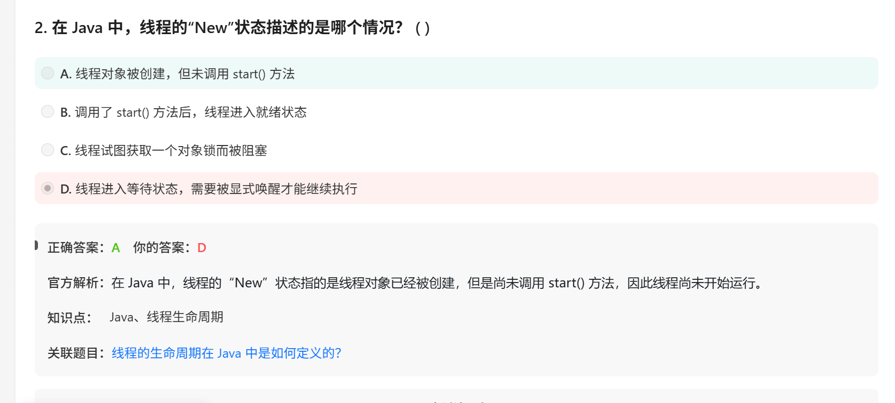

记录自己不太清楚的地方 需要重点复习的
什么是浅拷贝和深拷贝？
```
浅拷贝是 创建新的对象 只复制属性值 对于引用类型的只复制其地址
深拷贝是完全复制整个对象包括引用类型的属性
```
### java线程的生命周期定义在Thread.State枚举中，一共六种状态：
[线程的生命周期在 Java 中是如何定义的？ - 面试鸭 | 2026最新面试题+详细答案解析](https://www.mianshiya.com/question/1780933294871834626)

  
### Java 中 ConcurrentHashMap 1.7 和 1.8 之间有哪些区别？
[Java 中 ConcurrentHashMap 1.7 和 1.8 之间有哪些区别？ - 面试鸭 | 2026最新面试题+详细答案解析](https://www.mianshiya.com/question/1780933294813114369)

  
### 你了解 Java 线程池的原理吗？
[你了解 Java 线程池的原理吗？ - 面试鸭 | 2026最新面试题+详细答案解析](https://www.mianshiya.com/question/1780933294892806145)

