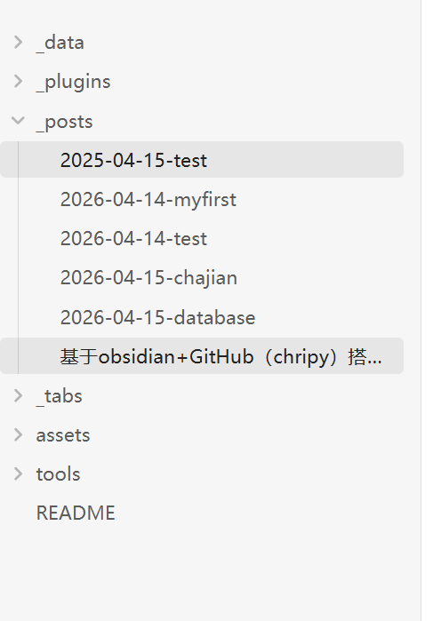

# 一.使用仓库chripy

在GitHub上面搜索(https://github.com/cotes2020/chirpy-starter) 

出现该页面点击右上方的use this template
创建新的仓库：名字是你的github名字.github.io
创建成功后clone到本地文件夹中 如果觉得麻烦可以下载GitHub desktop 可以帮助我们使用git命令

笔记是保存在_posts下面的 图片是保存在assets下的blog_res（[文件图片的问题](#文件图片的问题)）

# 文件图片的问题